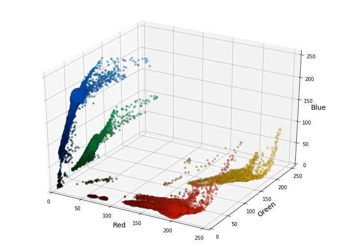
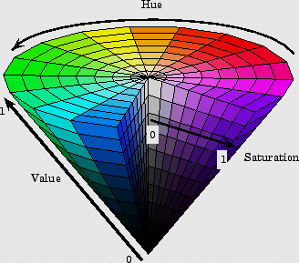

# Auto-Color V0.2  

## Automatic Color Scheme Generation using K-means Clustering.

This project aims to generate color schemes that complements any set of input colors by clustering a set of colors in 3d space.

This is only a proof of concept / MVP - check below link for development journal / planning / roadmap / notes.

[AutoColor Notes](https://light-brook-fae.notion.site/AutoColor-0691e08e305b4b7cb6c54dc8cf0ee50e)

### Problem Definition:
There is some friction involved when a user needs to define a color scheme for the presentation of their content - such as in cases of any CMS system, personal blog provider, etc.

### Proposed Solution:

The aim of this project is to provide color scheme suggestions - based on the content in the relevant context - such as images in a blog.

It has the ability to extract the colors of images, and use pre-existing notions of color harmony to figure out a pleasant mix of colors to use based on those extracted colors.

Furthermore - I use an unsupervised machine learning technique to cluster similar colors to lay the groundwork for creating suggestions of colors that harmonize with multiple sources of colors - i.e generating a color scheme that works with both the image itself but also the images surrounding.

### Next Step:

- Create scaffolding for paid API - as proof of concept.
- Read more in aformentioned Notion Notebook.

### Technical Definition:

- I extract the dominating colors from an image.
- I then use notions about color theory to suggest complementing colors for the image.
- I then mix this color palette with a palette of another image.
- I cluster the colors using a k-means clustering algorithm and use the silhouette method to score each value of K.
- I present the resulting palette.

### KMeans Clustering Notes:

- K-Means clustering is basically plotting datapoints in space and drawing boundaries around them to group points that are close together in such a way that the average distance from the center of a cluster to each point in the cluster is as low as possible.
- The number of clusters are detemined by K.
- To determine the optimal value of K - each possible K value is tried and then scored using the silhouette method.
- The silhouette method calculates the average distance between a point and all the other points in the cluster, and the average distance to all the points in the nearest cluster.
- If the average distance to the nearest cluster is much higher than the average distance to it's own cluster, it is good since that mean the boundaries between the clusters are highly defined.

### Issues:

- The method I have implemented has all the parts needed but quite some consideration needs to be taken about the order of operations.
  - Right now I extract colors --> find complements --> mix with other image --> cluster
  - But it is not clear to me it's the best way.
  - When I mix the images I should strip outlier colors.
  - I should take in to consideration the order of dominance of the colors.
  - I should go through each complement generation method and suggest the one who has the tightest fit - i.e lowest overall variance of the optimal K value.
    - Now it's always the same complement method for both images. complementary <--> complementary.
      - Triadic <--> Complementary
      - Quadratic <--> Triadic
      - Etc.
- I need to weight the dimensions appropriately since colors are subjectively more like each other the brighter or darker they are, they should provide a detrimental weight to the distance between points for lower S values and values of L that are far from the center.
  - Currently, I am doing this with H,S,L in euclidean space - I should do it in HSV using an inverted cone as pictured below

